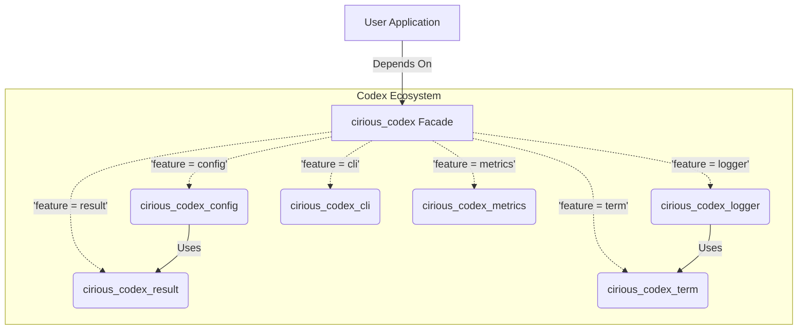

# Architecture & Design Philosophy

The **Cirious Codex** ecosystem is built around the **Facade Pattern**. Instead of forcing users to manage multiple small dependencies, we expose a single, cohesive crate (`cirious_codex`) that orchestrates specialized internal libraries.

## System Diagram

## Internal Crates

1. **`cirious_codex_config`**: Handles file I/O, format parsing (JSON, TOML, YAML), environment variable merging, and `serde` deserialization.
2. **`cirious_codex_logger`**: Implements the macro interface (`info!`, `error!`), and coordinates `Dispatchers` and `Formatters`.
3. **`cirious_codex_result`**: Replaces the standard `Result` type with a hyper-detailed custom wrapper `CodexError` and `CodexOk`.
4. **`cirious_codex_term`**: A lightweight library to handle ANSI terminal colors, styles, and advanced terminal formatting without pulling heavy external dependencies.
5. **`cirious_codex_cli`**: Automates argument parsing, logger bootstrapping, and configuration loading.
6. **`cirious_codex_metrics`**: Handles metric collection, aggregation, and Prometheus exposition.

## The Facade Advantage

By importing just `cirious_codex`, you gain access to the entire suite via feature flags. This ensures:
- **Zero Version Conflicts**: Internal crates are guaranteed to be compatible.
- **Opt-in Performance**: You only compile the features you explicitly enable.
- **Unified Documentation**: You can browse the entire ecosystem's docs through a single entry point.
